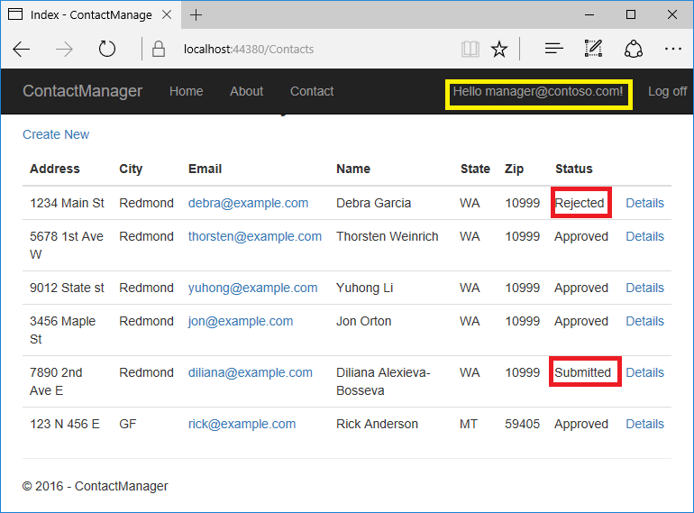
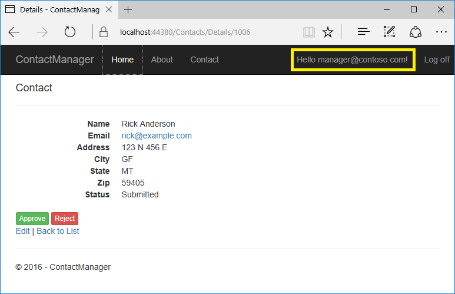
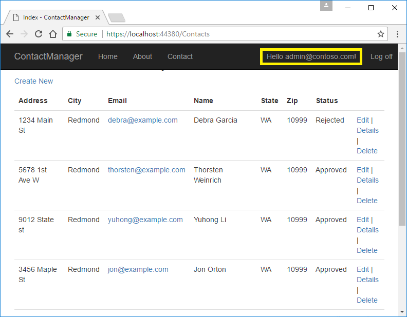

# Create an app with user data protected by authorization

By [Rick Anderson](https://twitter.com/RickAndMSFT) and [Joe Audette](https://twitter.com/joeaudette)

This tutorial shows how to create a web app with user data protected by authorization. It  displays a list of contacts that Authenticated (registered) users have created. In the following image, user `rick@example.com` is signed in. Only the last record, created by `rick@example.com` displays edit and delete links. User Rick can only view approved contacts.


Authenticated users can read all approved contacts but can only edit their own contacts. 

In the following image, `manager@contoso.com` is signed in and in the managers role. 



The manager can view all contacts. The manager can only edit and delete contacts she creates. The status field on the Index page shows `Submitted`, `Approved`, or `Rejected`. The manager or administrator can set a contact to `Approved` or `Rejected`

The following image shows the details view of a contact. The manager can approve or reject a contact. 



In the following image, `admin@contoso.com` is signed in and in the administrators role. 



The administrator has all privlidges. She can read/edit/delete any contact and change the status of contacts.

The app was created by [scaffolding](xref:tutorials/first-mvc-app-xplat/adding-model#scaffold-the-moviecontroller)  the following `Contact` model:

[!code-csharp[Main](secure-data/samples/starter/Models/Contact.cs?name=snippet1)]

The contact information properties (Address, Name, etc.) are displayed in the images above. `ContactId` is the primary key for the table.

A `ContactIsOwnerAuthorizationHandler` authorization handler ensures that data can only be edited by the data owner. A `ContactManagerAuthorizationHandler` authorization handler allows managers to approve or reject contacts.  A `ContactAdministratorsAuthorizationHandler` authorization handler allows administrators to approve or reject contacts and to edit/delete contacts. 

## Prerequisites

This is not a beginning tutorial. You should be familiar with [creating an ASP.NET Core MVC app](xref:tutorials/first-mvc-app/start-mvc).

## The starter app

[Download](https://github.com/aspnet/Docs/tree/master/aspnet/security/authorization/secure-data/samples/starter) and test the starter app. See [Create the starter app](#create-the-starter-app) if you'd like to create it.

Update the database:

````none

   dotnet ef database update
   ````

Run the app, tap the **ContactManager** link, and verify you can create, edit, and delete a contact.

## Tie the contact data to the user

We'll use the ASP.NET [Identity](xref:security/authentication/identity) user ID to ensure users can edit their data, but not other users data. Add `OwnerID` to the `Contact` model :

[!code-csharp[Main](secure-data/samples/final15/Models/Contact.cs?name=snippet1&highlight=5-6,16-)]

`OwnerID` is the user's ID from the `AspNetUser` table in the [Identity](xref:security/authentication/identity) database. The `Status` field determines if a contact is viewable by general users. 

Scaffold a new migration and update the database:

```console
dotnet ef migrations add userID_Status
dotnet ef database update
 ```

## Require SSL and authenticated users

In the `ConfigureServices` method of the *Startup.cs* file, add the [RequireHttpsAttribute](http://docs.asp.net/projects/api/en/latest/autoapi/Microsoft/AspNetCore/Mvc/RequireHttpsAttribute/index.html.md#Microsoft.AspNetCore.Mvc.RequireHttpsAttribute.md) authorization filter that requires all requests use HTTPS:

[!code-csharp[Main](secure-data/samples/final15/Startup.cs?name=snippet_SSL&highlight=1)]

If you're using Visual Studio, see [Set up IIS Express for SSL/HTTPS](xref:security/enforcing-ssl#set-up-iis-express-for-sslhttps). To redirect HTTP requests to HTTPS, see [URL Rewriting Middleware](xref:fundamentals/url-rewriting).

### Require authenticated users

Set the default authentication policy to require users to be authenticated. You can opt out of authentication at the controller or action method with the `[AllowAnonymous]` attribute. With this approach, any new controllers added will automatically require authentication, which is more fail safe than relying on new controllers to include the `[Authorize]` attribute. Add the following to  the `ConfigureServices` method of the *Startup.cs* file:

[!code-csharp[Main](secure-data/samples/final15/Startup.cs?name=snippet_defaultPolicy&highlight=2-)]

Add `[AllowAnonymous]` to the home controller so anonymous users can get information about the site before they register.

[!code-csharp[Main](secure-data/samples/final15/Controllers/HomeController.cs?name=snippet1&highlight=2,6)]

## Configure the test account

The `SeedData` class creates a two accounts,  administrator and manager. Use the [Secret Manager tool](xref:security/app-secrets) to set a password for these accounts. Do this from the project directory (the directory containing *Program.cs*).

```console
dotnet user-secrets set SeedUserPW <PW>
```

Update `Configure` to use the test password:

[!code-csharp[Main](secure-data/samples/final15/Startup.cs?name=Configure&highlight=19-21)]

Add the administrator user ID and `Status = ContactStatus.Approved` to the contacts. Only one contact is shown, add the user ID to all contacts:

[!code-csharp[Main](secure-data/samples/final15/Data/SeedData.cs?name=snippet1&highlight=17,18)]

## Create owner, manager, and administrator authorization handlers

Create a `ContactIsOwnerAuthorizationHandler` class in the  *Authorization* folder. The `ContactIsOwnerAuthorizationHandler` will verify the user acting on the resource owns the resource.

[!code-csharp[Main](secure-data/samples/final15/Authorization/ContactIsOwnerAuthorizationHandler.cs)]

The `ContactIsOwnerAuthorizationHandler` calls `context.Succeed` if the current authenticated user is the contact owner. Authorization handelers generally return `context.Succeed` when the requirements are met. They return `Task.FromResult(0)` when requirements are not met. `Task.FromResult(0)` is neither success or failure, it allows other authorization handler to run. If you need to explicitly fail, return `context.Fail()`.

We allow contact owners to edit/delete their own data, so we don't need to check the operation passed in the requirement parameter.

### Create a manager authorization handler

Create a `ContactManagerAuthorizationHandler` class in the  *Authorization* folder. The `ContactManagerAuthorizationHandler` will verify the user acting on the resource is a manager. Only managers can approve or reject content changes (new or changed).

[!code-csharp[Main](secure-data/samples/final15/Authorization/ContactManagerAuthorizationHandler.cs)]

### Create a administrator authorization handler

Create a `ContactAdministratorsAuthorizationHandler` class in the  *Authorization* folder. The `ContactAdministratorsAuthorizationHandler` will verify the user acting on the resource is a administrator. Administrator can do all operations.

[!code-csharp[Main](secure-data/samples/final15/Authorization/ContactAdministratorsAuthorizationHandler.cs)]

## Register the authorization handlers

Services using Entity Framework Core must be registered for [dependency injection](xref:fundamentals/dependency-injection) using [AddScoped](http://docs.asp.net/projects/api/en/latest/autoapi/Microsoft/Extensions/DependencyInjection/ServiceCollectionServiceExtensions/index.html.md#Microsoft.Extensions.DependencyInjection.ServiceCollectionServiceExtensions.AddScoped.md). The `ContactIsOwnerAuthorizationHandler` uses ASP.NET Core [Identity](xref:security/authentication/identity), which is built on Entity Framework Core. Register the handlers with the service collection so they will be available to the `ContactsController` through [dependency injection](xref:fundamentals/dependency-injection). Add the following code to the end of `ConfigureServices`:

[!code-csharp[Main](secure-data/samples/final15/Startup.cs?name=AuthorizationHandlers)]

`ContactAdministratorsAuthorizationHandler` and `ContactManagerAuthorizationHandler` are added as a singleton because all the information needed is in the `Context` parameter of the *HandleRequirementAsync* method.

The complete `ConfigureServices`:

[!code-csharp[Main](secure-data/samples/final15/Startup.cs?name=ConfigureServices)]

## Update the code to support authorization

In this section, you update the controller, views and add an operations requirements class.

### Update the Contacts controller

Update the `ContactsController` constructor:

* Add the `IAuthorizationService` service to  access to the authorization handlers. 
* Add the `Identity` `UserManager` service:

[!code-csharp[Main](secure-data/samples/final15/Controllers/ContactsController.cs?name=snippet_ContactsControllerCtor)]

### Add a contact operations requirements class

Add the `ContactOperationsRequirements` class to the *Authorization* folder. This class  contain the requirements our app supports:

[!code-csharp[Main](secure-data/samples/final15/Authorization/ContactOperations.cs)]

### Update Create

Update the `HTTP POST Create` method to:

* Add the user ID to the `Contact` model.
* Call the authorization handler to verify the user owns the contact.

[!code-csharp[Main](secure-data/samples/final15/Controllers/ContactsController.cs?name=snippet_Create&highlight=20-27)]


### Update Edit

Update both `Edit` methods to use the authorization handler to verify the user owns the contact. Because we are performing resource authorization we cannot use the `[Authorize]` attribute. We don't have access to the resource when attributes are evaluated. Resource based authorization must be imperative. Checks must be performed once we have access to the resource, either by loading it in our controller, or by loading it within the handler itself. Frequently you will access the resource by passing in the resource key.

[!code-csharp[Main](secure-data/samples/final15/Controllers/ContactsController.cs?name=snippet_Edit)]

### Update the Delete method

Update both `Delete` methods to use the authorization handler to verify the user owns the contact.

[!code-csharp[Main](secure-data/samples/final15/Controllers/ContactsController.cs?name=snippet_Delete)]

## Inject the authorization service into the views

Currently the UI shows edit and delete links for data the user cannot modify. We'll fix that by applying the authorization handler to the views.

Inject the authorization service in the *Views/_ViewImports.cshtml* file so it will be available to all views:

[!code-html[Main](secure-data/samples/final15/Views/_ViewImports.cshtml)]

Update the *Views/Contacts/Index.cshtml* Razor view to show only display the edit and delete links for the users data:

[!code-html[Main](secure-data/samples/final15/Views/Contacts/Index.cshtml?range=1-3,63-80)]

Warning: Hiding links from users that do not have permission to edit or delete data does not secure that app, it makes the app more user friendly by displaying only valid links. Users can hack the generated URLs to invoke edit and delete operations on data they don't own.  The controller must repeat the access checks to be secure.

### Update the Delete view

Update the delete view so managers and administrators have **Aprove** and **Reject** buttons:

[!code-html[Main](secure-data/samples/final15/Views/Contacts/Delete.cshtml?range=53-)]

## Test the app

Delete all the records in the `Contact` table and restart the app to seed the database. You'll need to register a user to browse the contact database.

An easy way to test the changes we made is to launch three different browsers (or incognito/InPrivate versions). Register a new user, for example, `test@example.com`. Sigin to each browser with a different user. 

* Registered users can view all the contact data and edit/delete their own data. 
* Managers can approve or reject contact data. The Details view shows Approve and Reject buttons. 
* Administrators can approve/reject and edit/delete any data.

| User| Options |
| ------------ | ---------|
| admin@contoso.com | Can edit/delete & approve/reject all data|
| manager@contoso.com | Can approve/reject |
| test@example.com | Can edit/delete own data |


## Create the starter app

* Create a new **ASP.NET Core Web Application** using [Visual Studio 2015](https://www.visualstudio.com/en-us/visual-studio-homepage-vs.aspx) named "ContactManager"

  * Create the app with **Individual User Accounts**.
  * Name it "ContactManager" so your namespace will match the namespace use in the sample.

* Add the following `Contact` model:

[!code-csharp[Main](secure-data/samples/starter/Models/Contact.cs?name=snippet1)]


* Scaffold the `Contact` model using Entity Framework Core and the `ApplicationDbContext` data context. Accept all the scaffolding defaults. Using `ApplicationDbContext` for the data context class  puts the contact table in the [Identity](xref:security/authentication/identity) database. See [Adding a model](xref:tutorials/first-mvc-app/adding-model) for more information.

* Update the **ContactManager** anchor in the *Views/Shared/_Layout.cshtml* file from `asp-controller="Home"` to `asp-controller="Contacts"` so tapping the **ContactManager** link will invoke the Contacts controller. The original markup:


````html

   <a asp-area="" asp-controller="Home" asp-action="Index" class="navbar-brand">ContactManager</a>
   ````

The updated markup:

````html

   <a asp-area="" asp-controller="Contacts" asp-action="Index" class="navbar-brand">ContactManager</a>
   ````

* Scaffold the initial migration and update the database


````none

   dotnet ef migrations add initial
   dotnet ef database update
   ````

* Test the app by creating, editing and deleting a contact

## Seed the database

Add the `SeedData` class to the *Data* folder. If you've downloaded the sample, you can copy the *SeedData.cs* file to the *Data* folder of the starter project.

[!code-csharp[Main](secure-data/samples/starter/Data/SeedData.cs)]


Add the highlighted code to the end of the `Configure` method in the *Startup.cs* file:

[!code-csharp[Main](secure-data/samples/Starter/Startup.cs?name=Configure&highlight=28-)]


Test that the app seeded the database. The seed method will not run if there are any rows in the contact DB.

### Create the resources for the tutorial

* Create a folder named *Authorization*.
* Copy the *Authorization\ContactOperations.cs* file from the completed project download, or copy the following code:

[!code-csharp[Main](secure-data/samples/final15/Authorization/ContactOperations.cs)]

<a name=secure-data-add-resources-label></a>

### Additional resources

* [ASP.NET Core Authorization Lab](https://github.com/blowdart/AspNetAuthorizationWorkshop)
* [Authorization](index.md)
* [Custom Policy-Based Authorization](policies.md)